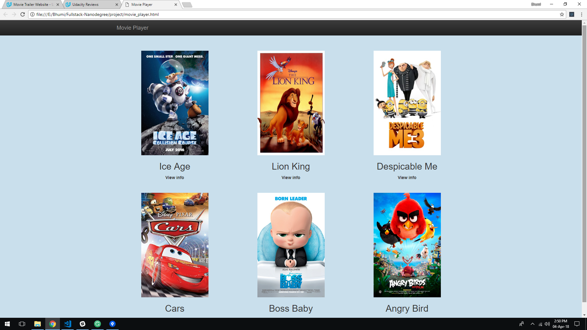
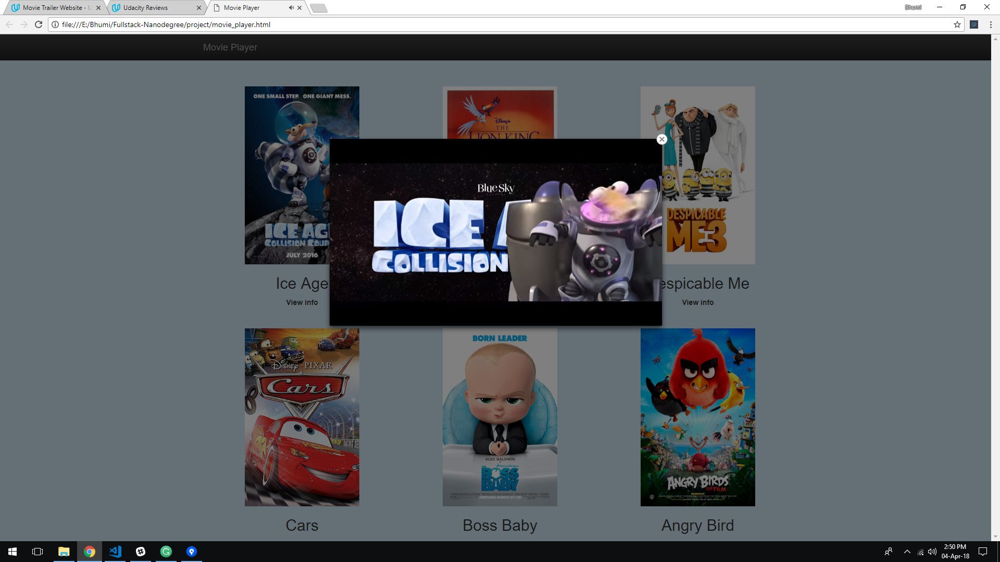
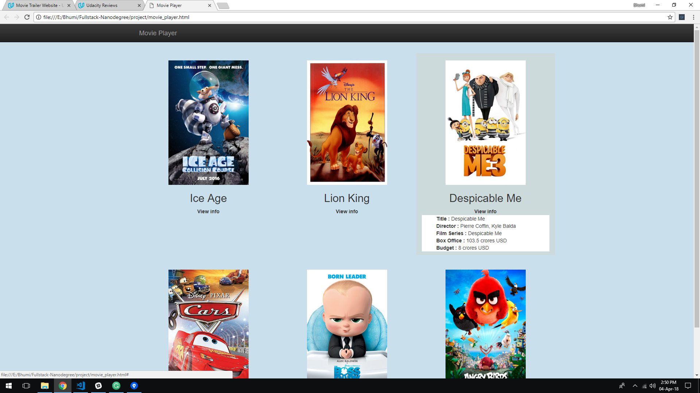

# Movie Trailer Project (Movie Website)

This project is a part of [Full Stack Web Developer Nanodegree Program](https://in.udacity.com/course/full-stack-web-developer-nanodegree--nd004). Here, a server-side code stores a list of Movies with all related details of it such as movie title, poster URL, YouTube link, director of the movie, the budget of the movie etc.

## Table of contents

* [Objective of Project](#objective-of-project)
* [Project Data Structure](#project-data-structure)
* [Project Files Details](#project-files-details)
* [Download Project](#download-project)
* [How to run Project](#how-to-run-project)
* [Demo of Project](#demo-of-project)

## Objective of Project

This project has the code to generate a static web page allowing visitors to browse their favorite movies and watch the trailers.

## Project Data Structure

This project uses object-oriented Python. So, there is a class Movie that acts as a template. This project creates instances of this class. Such as:

```python
movie_name = Movie()
```

The class Movie is defined in file <span>media.py</span>, and to create an instance of this class, a developer should import this file. After that, the instance will be created such as,

```python
movie_name = media.Movie()
```

Here, the `__init__()` function initializes the instance for the class Movie, so it requires the details of a movie as an argument. Such as:

### Syntax

```python
movie_name = media.Movie(movie_title, movie_poster, youtube_url, budget)
```

### Example

```python
ice_age = media.Movie("ice age", "...url...", "...youtube_url...", "10.5 crores USD")
```

After creating instances for the class Movie, an array of all instances is created. There is a function called open_movie_page() (defined in the file fresh_tomatoes.py) will take this array of movies as an argument and will generate the website page displaying the posters of movies.

```python
# movie_list is an array of movie which contains all the movie information

movie_list = [ice_age, lion_king, despicable_me, cars, boss_baby, angry_bird]

# open_movies_page is a function which takes the list of movie as an argument and display all movie poster on the screen

fresh_tomatoes.open_movies_page(movie_list)

```

## Project Files Details

In this project, there are main 3 files which are :

1. <span>media.py</span>
2. entertainment_center.py
3. fresh_tomatoes.py

The class Movie is defined within the file <span>media.</span>py and all instances of that class are defined within entertainment_center.py file. The fresh_tomatoes.py contains the open_movies_page() function that will take the list of movies and generate an HTML file to produce a website of your favorite movies.

## Download Project

Download the zip file of the project to your computer or you can clone this repository.

## How to run Project

Users can run this project by running below code on the command prompt.

```
python entertainment_center.py
```

## Demo of Project

This is the actual display of the project where the poster images of all favorite movies are available.



When a user clicks on the poster image, it will show the trailer of a particular movie.



There is an extra option available for users to see details of a particular movie by hovering the mouse on the **View info** link.

